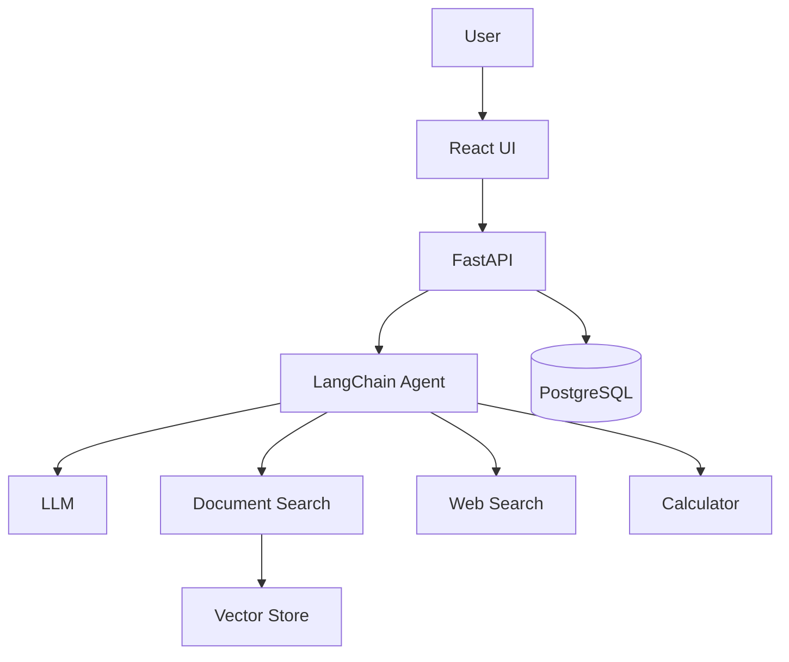
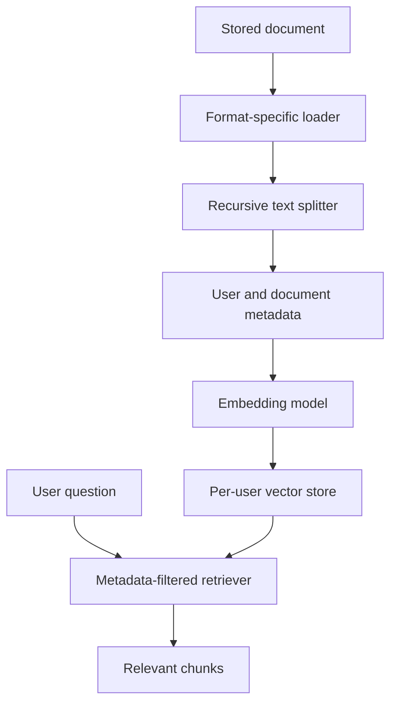

# Production Multi-Tool Conversational AI Agent

A learning project for building a production-style conversational assistant with FastAPI, React, LangChain, PostgreSQL, document retrieval, web search, calculator tools, authentication, and streaming responses.

## Current Status: Usable Local Application

The application is now usable locally. It includes the Phase 1-10 foundations, automatic SQLite startup, document indexing on upload, authenticated chat context, streaming agent responses, and a React dashboard. The optional calculator phase was intentionally skipped. PostgreSQL remains available through `DATABASE_URL` for a production deployment.

We will verify each phase before adding the next one.

## Planned Architecture



## Planned Project Areas

- `backend/app`: FastAPI application and future domain modules.
- `frontend/src`: React application.
- `data/uploads`: Local development storage for uploaded documents.
- `docker-compose.yml`: Local PostgreSQL service for later phases.

## Database Design

- `users` owns accounts and uploaded documents.
- `chats` belongs to one user.
- `messages` belongs to one chat and is deleted with that chat.
- `documents` belongs to one user, which provides the ownership boundary needed by RAG retrieval.

The models use UUID identifiers, foreign keys, timestamps, and SQLAlchemy relationships. PostgreSQL is not installed or running yet, so live connection verification will happen when we choose the database setup.

## Chat API

Authenticated chat endpoints currently support:

- `POST /chats`
- `GET /chats`
- `GET /chats/{chat_id}`
- `DELETE /chats/{chat_id}`
- `POST /chats/{chat_id}/messages`

Chat ownership is always taken from the authenticated JWT. A client cannot provide another user's ID to access their conversations.

## Document API

Authenticated document endpoints currently support:

- `POST /documents/upload`
- `GET /documents`
- `DELETE /documents/{document_id}`

Uploads currently accept PDF, DOCX, TXT, and CSV files up to 10 MB. Files are stored with generated UUID filenames, while the original filename is retained as metadata. Retrieval and deletion are scoped to the authenticated user.

## RAG Pipeline



Phase 6 uses deterministic local embeddings and an in-memory vector store for development and tests. The embedding class and vector-store wrapper are replaceable; a persistent production vector store and API-backed embedding model will be selected before deployment. Upload processing is connected to this pipeline in a later phase after the independent RAG tests are verified.

The document search tool receives a structured query and document ID. Its authenticated user identity is bound when the tool is created, and ownership is checked against the database before vector retrieval.

The web search tool receives a structured query and calls Tavily only when `SEARCH_API_KEY` is configured. The provider is isolated behind `TavilySearchProvider`, so another search API can replace it without changing the agent tool contract.

The agent factory binds the authenticated user's document tool and the web search tool to a configured LLM. It does not expose intermediate reasoning; only the final answer is returned by the executor.

## Run Locally

Backend:

```bash
cd /home/bandaru/prem/Langchain/Day-5/Langchain-Agent
source .venv/bin/activate
cp .env.example .env
PYTHONPATH=backend uvicorn app.main:app --reload
```

Frontend, in another terminal:

```bash
source ~/.nvm/nvm.sh
nvm use --lts
cd /home/bandaru/prem/Langchain/Day-5/Langchain-Agent/frontend
npm install
npm run dev
```

Open `http://localhost:5173`. Registration, login, conversations, uploads, and document indexing work with the local SQLite default. Set `LLM_API_KEY` in `.env` for assistant answers and `SEARCH_API_KEY` for web search.

## Tests

```bash
cd /home/bandaru/prem/Langchain/Day-5/Langchain-Agent
PYTHONPATH=backend .venv/bin/python -m pytest backend/tests -q
```

## Environment Setup

1. Copy `.env.example` to `.env`.
2. Add credentials only to `.env`; never commit them.
3. Install backend dependencies from `backend/requirements.txt`.
4. Install frontend dependencies with `npm install` inside `frontend`.

## Phase 1 Checks

Backend health check:

```bash
uvicorn backend.app.main:app --reload
curl http://127.0.0.1:8000/health
```

Expected response:

```json
{"status":"ok"}
```

Frontend:

```bash
cd frontend
npm install
npm run dev
```

The remaining phases will add database persistence, authentication, chat APIs, RAG, tools, agent orchestration, streaming, tests, and production cleanup incrementally.
