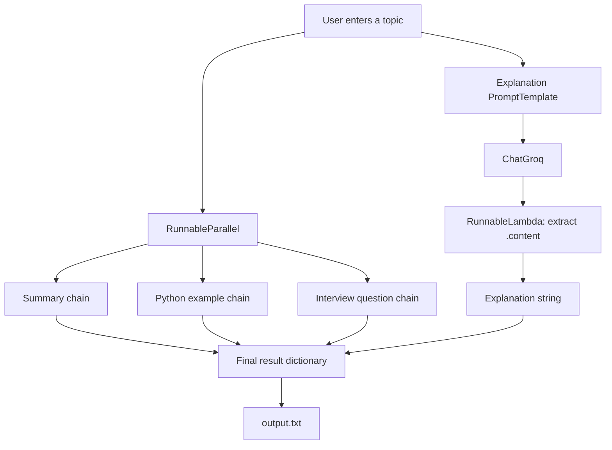

# AI Learning Assistant

A beginner-friendly LangChain project that turns a topic into a compact learning pack:

- A concise explanation
- A short summary
- A simple Python example
- An interview question and answer

The project demonstrates multi-step chains, `RunnableSequence`, the pipe operator, `RunnableLambda`, `RunnableParallel`, and `.invoke()` using Groq's API through `ChatGroq`.

## Workflow



## Example

Input:

```text
What is RAG?
```

The generated file contains sections similar to:

```text
========== EXPLANATION ==========
...

========== SUMMARY ==========
...

========== PYTHON EXAMPLE ==========
...

========== INTERVIEW QUESTION ==========
...
```

## Project Structure

```text
multi-step-chain/
├── .env              # Local API key; do not commit this file
├── .venv/            # Python virtual environment
├── main.py           # Complete application
├── output.txt        # Generated output; overwritten on every run
└── README.md         # Project documentation
```

## Requirements

- Python 3.9 or newer
- A Groq API key
- Internet access for Groq API requests

The project was developed with Python 3.9 and these package versions:

- `langchain==0.3.30`
- `langchain-core==0.3.86`
- `langchain-groq==0.3.8`
- `groq==0.37.1`
- `python-dotenv==1.2.1`

## Installation

### 1. Open the project directory

```bash
cd /home/bandaru/prem/Langchain/multi-step-chain
```

### 2. Create a virtual environment

```bash
python3.9 -m venv .venv
```

If `python3.9` is not available, use another installed Python 3 version:

```bash
python3 -m venv .venv
```

### 3. Activate the virtual environment

Linux and macOS:

```bash
source .venv/bin/activate
```

Windows PowerShell:

```powershell
.venv\Scripts\Activate.ps1
```

Confirm that the environment is active:

```bash
python --version
python -m pip --version
```

The pip path should contain `.venv`.

### 4. Install the packages

Upgrade pip first:

```bash
python -m pip install --upgrade pip
```

Install the dependencies from `requirements.txt`:

```bash
python -m pip install -r requirements.txt
```

The file pins compatible versions of LangChain, LangChain Core, LangChain Groq,
Groq, and `python-dotenv`.

Verify the installation:

```bash
python -m pip show langchain langchain-core langchain-groq groq python-dotenv
```

## Configure the API Key

Create a file named `.env` in the project root:

```env
GROQ_API_KEY=your_groq_api_key_here
```

Replace the placeholder with your own key. Never place the key directly in `main.py`, publish it in the README, or commit `.env` to a public repository.

The application uses `python-dotenv` to load `.env` and reads the key with:

```python
load_dotenv()
os.getenv("GROQ_API_KEY")
```

## Run the Application

With the virtual environment activated, run:

```bash
python main.py
```

Enter a topic when prompted:

```text
Enter a topic: What is RAG?
```

The prompt is displayed in the terminal. The generated explanation, summary, example, and interview answer are saved to `output.txt`.

To run without activating the environment, use:

```bash
.venv/bin/python main.py
```

## Understanding the Code

### `PromptTemplate`

A `PromptTemplate` is a reusable prompt with placeholders:

```python
summary_prompt = PromptTemplate.from_template(
    "Summarize {topic} in exactly three beginner-friendly bullet points."
)
```

Its input is a dictionary:

```python
{"topic": "What is RAG?"}
```

It produces a formatted prompt string for the model.

### `RunnableSequence`

A sequence runs components from left to right:

```python
explanation_chain = RunnableSequence(
    explanation_prompt,
    model,
    content_extractor,
)
```

The data flow is:

```text
input dictionary
    ↓
PromptTemplate
    ↓
formatted prompt
    ↓
ChatGroq
    ↓
AIMessage
    ↓
RunnableLambda
    ↓
plain string
```

The same chain can also be written with the pipe operator:

```python
explanation_chain = explanation_prompt | model | content_extractor
```

The `|` means that the output of one runnable becomes the input of the next runnable.

### `AIMessage` and `.content`

`ChatGroq` returns an `AIMessage`, not an ordinary Python string. The generated text is stored in its `.content` property.

```python
def extract_content(message):
    return message.content
```

`RunnableLambda` wraps this normal Python function so it can participate in the LangChain sequence:

```text
AIMessage → RunnableLambda → str
```

### `RunnableParallel`

The three independent tasks are grouped together:

```python
parallel_chain = RunnableParallel(
    summary=summary_chain,
    python_example=example_chain,
    interview=interview_chain,
)
```

They receive the same input and run concurrently:

```text
{"topic": "What is RAG?"}
             │
     ┌───────┼────────┐
     ▼       ▼        ▼
 summary  example  interview
     └───────┼────────┘
             ▼
{
    "summary": "...",
    "python_example": "...",
    "interview": "..."
}
```

### `.invoke()`

`.invoke()` starts a runnable with one input:

```python
result = explanation_chain.invoke({"topic": topic})
```

In this project:

- `PromptTemplate.invoke(...)` receives a dictionary.
- `ChatGroq.invoke(...)` produces an `AIMessage`.
- `content_extractor.invoke(...)` produces a string.
- `parallel_chain.invoke(...)` produces a dictionary containing three strings.

## Output Behavior

`main.py` opens `output.txt` in write mode:

```python
open("output.txt", "w", ...)
```

Therefore every run replaces the previous output instead of appending to it.

The topic prompt remains visible in the terminal, while the generated results are written to `output.txt`. Open the file in VS Code after the run to read the complete response.

## Troubleshooting

### `GROQ_API_KEY is not set`

Make sure `.env` is in the same directory as `main.py` and contains:

```env
GROQ_API_KEY=your_groq_api_key_here
```

Also confirm that the virtual environment is active.

### `ModuleNotFoundError`

Activate `.venv` and install the packages again:

```bash
source .venv/bin/activate
python -m pip install -r requirements.txt
```

### `model_not_found`

The model name must be available to your Groq account. The current application uses:

```python
model="openai/gpt-oss-20b"
```

To list models available to your key:

```bash
python -c 'from dotenv import load_dotenv; import os; from groq import Groq; load_dotenv(); client = Groq(api_key=os.environ["GROQ_API_KEY"]); print("\n".join(model.id for model in client.models.list().data))'
```

### `RateLimitError`

Groq limits requests and tokens over time. Wait briefly and retry. The application keeps responses concise with `max_tokens=600`.

## Learning Checklist

- [x] Create a `PromptTemplate`
- [x] Connect runnables sequentially with `RunnableSequence`
- [x] Use the `|` operator for a sequence
- [x] Call chains with `.invoke()`
- [x] Understand `AIMessage` and `.content`
- [x] Wrap a Python function with `RunnableLambda`
- [x] Build independent chains
- [x] Run chains with `RunnableParallel`
- [x] Combine results into a final workflow
- [x] Save the application output to a text file

## Security Notes

- Keep `.env` private.
- Never hard-code `GROQ_API_KEY` in Python files.
- Do not share `output.txt` if generated content contains private information.
- Consider adding `.env`, `.venv/`, and `output.txt` to `.gitignore` before publishing the project.
